# PHASE 3D.4 — CANONICAL CONTENT RECONCILIATION & MIGRATION MATRIX
**Vedanta Mission / Vedanta Ashram, Indore**  
*Document Version:* 1.1.0 (Mechanically Normalized & Validated via Phase 3D.4A)  
*Date:* September 2026  
*Status:* COMPLETE — RECONCILIATION ONLY (READ-ONLY BASELINE FOR MIGRATION)  
*Upstream Source of Truth:* `docs/migration/PHASE-3D3-LEGACY-MASTER-INVENTORY.json` (2,752 raw records)  
*Downstream Destination:* Canonical Migration Model & Information Architecture Routing  

---

## 1. Executive Summary

Phase 3D.3 established the first complete, empirical discovery inventory of the legacy V-Mission digital universe, capturing **2,752 raw discovery records** spanning 88 WordPress pages, 39 posts, 854 images, 57 Google Photos albums, 381 audio records, 479 video records, 712 monthly publication records, 26 e-book mirrors, and 113 study PDFs.

**Phase 3D.4 & Phase 3D.4A perform the critical transformation:**  
They convert raw legacy rows, mirror links, duplicate embeds, and container pages into a verified **CANONICAL MIGRATION MODEL** consisting of **2,014 Unique Canonical Content Entities**, while strictly accounting for every single one of the 2,752 legacy discovery records with **zero unmapped items (0 unmapped)** and **zero multi-mapped items (0 multi-mapped)**.

### Core Architectural Clarifications
1. **Canonical Entity vs. Source Record:** A monthly issue of *Vedanta Sandesh* or *Vedanta Piyush* (which appeared up to 6 times across Issuu, Google Drive, Box, pCloud, Archive.org, and Scribd) is collapsed into **ONE Canonical Publication Issue** with a primary canonical source and structured fallback mirrors. Similarly, the 26 raw e-book mirror links collapse cleanly into **6 Canonical Monographs/E-Books**.
2. **Container vs. Child Content:** YouTube playlists (49 series), Google Photos albums (44 unique collections), and shared audio folders (183 series) are formally structured as **Containers/Collections**, distinctly separating them from their individual Child Lectures, Child Tracks, and Child Assets.
3. **VM Footprints Architecture:** 1 Collection Container (`canonical-000089`) holds hierarchical links to **11 Individual Child Slides** (`canonical-000090` to `canonical-000100`), yielding **12 Canonical Entities** representing the 11 raw homepage slide assets without multi-mapping.
4. **Private/Administrative Boundary:** Administrative utilities (`/bookmarks/` with 372 links and `/swamitas-bookmark/` with 104 links) are explicitly classified as `PRIVATE / ADMINISTRATIVE — NOT PUBLIC MIGRATION` and excluded from public routing.
5. **Historical Continuity:** Historical camp/yagna posts (39 items) and the *VM Footprints* tour archive are preserved as authentic historical archives (`ARCHIVE`), ensuring no institutional heritage is lost.

---

## 2. Master Coverage Dashboard

### 2.1 High-Level Metrics (Mechanically Derived from JSON)

| Metric Category | Count | Percentage |
| :--- | :--- | :--- |
| **Total Raw Legacy Records Analyzed** | **2,752** | 100.0% |
| **Total Processed Legacy IDs** | **2,752** | 100.0% (Zero Unmapped, Zero Duplicated) |
| **Total Canonical Content Entities** | **2,014** | 100.0% |
| **Containers & Collections** | **335** | 16.6% |
| **Individual Content Items** | **1,679** | 83.4% |
| **Total Source / Mirror Records Reconciled** | **738** | (2,014 Entities + 738 Mirrors = 2,752 Raw Records) |
| **Currently Present in New Site** | **103** | 5.1% |
| **Partially Present in New Site (Topic exists, files missing)** | **1,642** | 81.5% |
| **Missing from New Site (Net New Content to Migrate)** | **268** | 13.3% |
| **Archival Material (Public Historical Continuity)** | **998** | 49.6% |
| **Entities Requiring Verification** | **1** | 0.05% |
| **Intentionally Excluded / Removed (Private/Broken)** | **4** | 0.20% |

---

### 2.2 Category-by-Category Migration Summary

| Content Category | Raw Records | Canonical Entities | Containers | Individual Items | Mirrors Reconciled | Present | Partial | Missing | Primary Action |
| :--- | :---: | :---: | :---: | :---: | :---: | :---: | :---: | :---: | :--- |
| **Institutional & Governance** | 88 | 79 | 57 | 22 | 9 | 19 | 50 | 9 | MERGE / KEEP |
| **Acharyas & Lineage** | 5 | 5 | 1 | 4 | 0 | 5 | 0 | 0 | KEEP |
| **Ashram Facilities & Parivar** | 5 | 5 | 0 | 5 | 0 | 4 | 1 | 0 | KEEP / MERGE |
| **VM Footprints Tour Archive** | 11 | 12 | 1 | 11 | 0 | 0 | 1 | 11 | ARCHIVE |
| **Events & Historical Reports** | 39 | 39 | 0 | 39 | 0 | 0 | 3 | 36 | ARCHIVE / MIGRATE |
| **Photo Albums (Google Photos)** | 57 | 44 | 44 | 0 | 13 | 0 | 44 | 0 | ARCHIVE |
| **Publications (Sandesh & Piyush)** | 712 | 164 | 0 | 164 | 548 | 27 | 0 | 137 | KEEP / ARCHIVE |
| **E-Books & Monographs** | 26 | 6 | 0 | 6 | 20 | 5 | 0 | 1 | KEEP / MIGRATE |
| **Study Texts & PDFs** | 113 | 80 | 0 | 80 | 33 | 7 | 0 | 73 | KEEP / MIGRATE |
| **Teachings Audio Archive** | 381 | 330 | 183 | 147 | 51 | 0 | 330 | 0 | MIGRATE / ARCHIVE |
| **Teachings Video Archive** | 479 | 405 | 49 | 356 | 74 | 0 | 405 | 0 | MIGRATE |
| **Courses & Curricula** | 5 | 5 | 5 | 0 | 0 | 3 | 2 | 0 | KEEP / MIGRATE |
| **WordPress Media Assets** | 843 | 843 | 58 | 785 | 0 | 21 | 822 | 0 | ARCHIVE / KEEP |
| **Legacy Errors / Defective** | 2 | 2 | 1 | 1 | 0 | 0 | 0 | 2 | REMOVE |
| **TOTALS** | **2,752** | **2,014** | **335** | **1,679** | **738** | **103** | **1,642** | **268** | — |

---

## 3. Destination Information Architecture Mapping

All canonical entities are mapped exclusively into the approved target routes:

```mermaid
graph TD
    Root["/ (Homepage)"] --> About["/about (Mission, History, Parivar, Trusts)"]
    Root --> Acharyas["/acharyas (Overview & Lineage)"]
    Acharyas --> AcharyaId["/acharyas/[id] (Guruji & 3 Swaminis)"]
    Root --> Ashram["/ashram (Campus, Temple, Accommodations, Footprints)"]
    Root --> Teachings["/teachings (Audio, Video, Discourse Directory)"]
    Teachings --> TeachGita["/teachings/bhagavad-gita"]
    Teachings --> TeachUpanishad["/teachings/upanishads"]
    Teachings --> TeachPrakarana["/teachings/prakarana-granth"]
    Teachings --> TeachDevotional["/teachings/devotional (Hanuman Chalisa, Stotras)"]
    Teachings --> TeachChanting["/teachings/chanting"]
    Teachings --> TeachMeditation["/teachings/meditation"]
    Teachings --> TeachStories["/teachings/inspiring-stories"]
    Root --> Pubs["/publications (Sandesh, Piyush, E-Books, Study Texts)"]
    Root --> Events["/events (Upcoming Programs & Historical Camp Archive)"]
    Root --> Learn["/learn (Courses: Gurukula, 40-Lesson Gita, Tattva Bodha)"]
    Root --> Donate["/donate (Seva, Trusts, Bank Details)"]
    Root --> Contact["/contact (Offices, Ashram Location, Inquiry Form)"]
```

---

## 4. Detailed Canonical Reconciliation by Category

### 4.1 Institutional & Governance Entities

| Canonical ID | Title | Type | New Site State | Destination | Action | Notes |
| :--- | :--- | :--- | :--- | :--- | :--- | :--- |
| `canonical-000001` | Course Information: Gita Course | course-hub | CURRENTLY PRESENT | `/learn` | **MERGE** | Legacy course registration and curriculum overview page merged into mo... |
| `canonical-000002` | Vedanta Ashram, Indore — Rooms | ashram-page | CURRENTLY PRESENT | `/ashram` | **MERGE** | Ashram facilities, accommodations, temple, and travel directions.... |
| `canonical-000005` | Vedanta Mission | legacy-page | UNKNOWN | `/about` | **VERIFY** | Legacy page slug "vedanta-mission" requiring manual content verificati... |
| `canonical-000022` | Swamitas Bookmark | administrative-utility | MISSING | `N/A (Private Archive Only)` | **REMOVE** | Private/administrative browser bookmark collection discovered on legac... |
| `canonical-000023` | BOOKMARKS | administrative-utility | MISSING | `N/A (Private Archive Only)` | **REMOVE** | Private/administrative browser bookmark collection discovered on legac... |
| `canonical-000025` | Ashram Parivar Fellowship & Membership | institutional-page | PARTIALLY PRESENT | `/about` | **MIGRATE** | Ashram Parivar spiritual fellowship initiative and registration detail... |
| `canonical-000029` | Swami Atmananda Saraswati (Poojya Guruji) | acharya-profile | CURRENTLY PRESENT | `/acharyas/swami-atmananda-saraswati` | **MERGE** | Biography, spiritual lineage, and teachings of the Founder Acharya.... |
| `canonical-000045` | Support & Donations (DONATION FOR :) | institutional-page | CURRENTLY PRESENT | `/donate` | **MERGE** | Donation options, bank account details, and seva causes.... |
| `canonical-000047` | Course Information: Online Courses | course-hub | CURRENTLY PRESENT | `/learn` | **MERGE** | Legacy course registration and curriculum overview page merged into mo... |
| `canonical-000052` | Course Information: Other Courses | course-hub | CURRENTLY PRESENT | `/learn` | **MERGE** | Legacy course registration and curriculum overview page merged into mo... |
| `canonical-000057` | Acharyas of Vedanta Mission Overview | institutional-page | CURRENTLY PRESENT | `/acharyas` | **KEEP** | Master directory of monastic teachers in Shankara lineage.... |
| `canonical-000060` | Swamini Samatananda Saraswati | acharya-profile | CURRENTLY PRESENT | `/acharyas/swamini-samatananda-saraswati` | **KEEP** | Biography and discourses of resident Acharya Swamini Samatananda Saras... |
| `canonical-000061` | Swamini Poornananda Saraswati | acharya-profile | CURRENTLY PRESENT | `/acharyas/swamini-poornananda-saraswati` | **KEEP** | Biography and discourses of resident Acharya Swamini Poornananda Saras... |
| `canonical-000062` | Swamini Amitananda Saraswati | acharya-profile | CURRENTLY PRESENT | `/acharyas/swamini-amitananda-saraswati` | **KEEP** | Biography and discourses of resident Acharya Swamini Amitananda Sarasw... |
| `canonical-000063` | Swami Atmananda Saraswati (Poojya Guruji) | acharya-profile | CURRENTLY PRESENT | `/acharyas/swami-atmananda-saraswati` | **KEEP** | Biography, spiritual lineage, and teachings of the Founder Acharya.... |
| `canonical-000064` | Vedanta Mission Spiritual Activities (Kinds of Activities) | institutional-page | PARTIALLY PRESENT | `/about` | **MERGE** | Overview of camps, yagnas, classes, chanting, and educational activiti... |
| `canonical-000067` | Vedanta Ashram, Indore — Directions | ashram-page | CURRENTLY PRESENT | `/ashram` | **MERGE** | Ashram facilities, accommodations, temple, and travel directions.... |
| `canonical-000068` | Vedanta Ashram, Indore — Facilities | ashram-page | CURRENTLY PRESENT | `/ashram` | **MERGE** | Ashram facilities, accommodations, temple, and travel directions.... |
| `canonical-000069` | Vedanta Mission Spiritual Activities (Activities) | institutional-page | PARTIALLY PRESENT | `/about` | **MERGE** | Overview of camps, yagnas, classes, chanting, and educational activiti... |
| `canonical-000070` | About Vedanta Mission (Introduction) | institutional-page | CURRENTLY PRESENT | `/about` | **MERGE** | Institutional background, history, and foundational mission of Vedanta... |
| `canonical-000071` | Contact Vedanta Mission & Ashram | institutional-page | CURRENTLY PRESENT | `/contact` | **KEEP** | Contact information, office address, phone numbers, and inquiry form.... |
| `canonical-000072` | Trusts & Centers: Centers | institutional-page | PARTIALLY PRESENT | `/about` | **MERGE** | Legal trusts (Vedanta Paravidya Pratishthan, etc.) and regional satsan... |
| `canonical-000073` | Trusts & Centers: Icf at Mumbai | institutional-page | PARTIALLY PRESENT | `/about` | **MERGE** | Legal trusts (Vedanta Paravidya Pratishthan, etc.) and regional satsan... |
| `canonical-000074` | Trusts & Centers: vpst at indore | institutional-page | PARTIALLY PRESENT | `/about` | **MERGE** | Legal trusts (Vedanta Paravidya Pratishthan, etc.) and regional satsan... |
| `canonical-000075` | Trusts & Centers: Our Trusts | institutional-page | PARTIALLY PRESENT | `/about` | **MERGE** | Legal trusts (Vedanta Paravidya Pratishthan, etc.) and regional satsan... |
| `canonical-000076` | Mission, Vision & Objectives (Objectives :) | institutional-page | CURRENTLY PRESENT | `/about` | **MERGE** | Core mission tenets, spiritual vision, and institutional objectives co... |
| `canonical-000077` | Mission, Vision & Objectives (Mission :) | institutional-page | CURRENTLY PRESENT | `/about` | **MERGE** | Core mission tenets, spiritual vision, and institutional objectives co... |
| `canonical-000078` | Mission, Vision & Objectives (Goal :) | institutional-page | CURRENTLY PRESENT | `/about` | **MERGE** | Core mission tenets, spiritual vision, and institutional objectives co... |
| `canonical-000079` | About Vedanta Mission (About :) | institutional-page | CURRENTLY PRESENT | `/about` | **MERGE** | Institutional background, history, and foundational mission of Vedanta... |
| `canonical-000080` | About Vedanta Mission (About) | institutional-page | CURRENTLY PRESENT | `/about` | **KEEP** | Institutional background, history, and foundational mission of Vedanta... |
| `canonical-000082` | About Vedanta Mission (Org) | institutional-page | CURRENTLY PRESENT | `/about` | **MERGE** | Institutional background, history, and foundational mission of Vedanta... |
| `canonical-000083` | Support & Donations (Donate) | institutional-page | CURRENTLY PRESENT | `/donate` | **KEEP** | Donation options, bank account details, and seva causes.... |
| `canonical-000084` | Vedanta Ashram, Indore — Ashram | ashram-page | CURRENTLY PRESENT | `/ashram` | **KEEP** | Ashram facilities, accommodations, temple, and travel directions.... |
| `canonical-000088` | Vedanta Mission Homepage | institutional-page | CURRENTLY PRESENT | `/` | **KEEP** | Primary root portal and welcome page for Vedanta Mission.... |

*(Showing 35 of 34 institutional entities; full set in JSON matrix)*

### 4.2 VM Footprints — Global Discourses & Tour Archive (1 Container + 11 Slides)

| Canonical ID | Title | Type | Container | Destination | Action | Canonical Source |
| :--- | :--- | :--- | :--- | :--- | :--- | :--- |
| `canonical-000089` | VM Footprints — Global Discourses & Tour Archive | image-collection | Container | `/ashram` | **ARCHIVE** | https://www.vmission.org.in/ |
| `canonical-000090` | VM Footprints — Slide 1 of 11: Global Activities & Mahatmas | image-asset | Individual | `/ashram` | **ARCHIVE** | https://www.vmission.org.in/wp-content/uploads/2019/10/img-vmission-footprints.jpg |
| `canonical-000091` | VM Footprints — Slide 2 of 11: Global Activities & Mahatmas | image-asset | Individual | `/ashram` | **ARCHIVE** | https://www.vmission.org.in/wp-content/uploads/2019/10/img-vmission-footprints-2.jpg |
| `canonical-000092` | VM Footprints — Slide 3 of 11: Global Activities & Mahatmas | image-asset | Individual | `/ashram` | **ARCHIVE** | https://www.vmission.org.in/wp-content/uploads/2019/10/img-vmission-footprints-3.jpg |
| `canonical-000093` | VM Footprints — Slide 4 of 11: Global Activities & Mahatmas | image-asset | Individual | `/ashram` | **ARCHIVE** | https://www.vmission.org.in/wp-content/uploads/2019/10/img-vmission-footprints-4.jpg |
| `canonical-000094` | VM Footprints — Slide 5 of 11: Global Activities & Mahatmas | image-asset | Individual | `/ashram` | **ARCHIVE** | https://www.vmission.org.in/wp-content/uploads/2019/10/img-vmission-footprints-5.jpg |
| `canonical-000095` | VM Footprints — Slide 6 of 11: Global Activities & Mahatmas | image-asset | Individual | `/ashram` | **ARCHIVE** | https://www.vmission.org.in/wp-content/uploads/2019/10/img-vmission-footprints-6.jpg |
| `canonical-000096` | VM Footprints — Slide 7 of 11: Global Activities & Mahatmas | image-asset | Individual | `/ashram` | **ARCHIVE** | https://www.vmission.org.in/wp-content/uploads/2019/10/img-vmission-footprints-7.jpg |
| `canonical-000097` | VM Footprints — Slide 8 of 11: Global Activities & Mahatmas | image-asset | Individual | `/ashram` | **ARCHIVE** | https://www.vmission.org.in/wp-content/uploads/2019/10/img-vmission-footprints-8.jpg |
| `canonical-000098` | VM Footprints — Slide 9 of 11: Global Activities & Mahatmas | image-asset | Individual | `/ashram` | **ARCHIVE** | https://www.vmission.org.in/wp-content/uploads/2019/10/img-vmission-footprints-9.jpg |
| `canonical-000099` | VM Footprints — Slide 10 of 11: Global Activities & Mahatmas | image-asset | Individual | `/ashram` | **ARCHIVE** | https://www.vmission.org.in/wp-content/uploads/2019/10/img-vmission-footprints-10.jpg |
| `canonical-000100` | VM Footprints — Slide 11 of 11: Global Activities & Mahatmas | image-asset | Individual | `/ashram` | **ARCHIVE** | https://www.vmission.org.in/wp-content/uploads/2019/10/img-vmission-footprints-11.jpg |

### 4.3 Publications Archive (Vedanta Sandesh & Vedanta Piyush)

> [!IMPORTANT]
> **Full Issue-Level Deduplication Completed:** 712 raw publication records collapsed into **164 Canonical Monthly Issues** across 2014–2021.
> - **Vedanta Sandesh:** 87 Canonical Issues (2014 to May 2021). 22 Present, 65 Missing.
> - **Vedanta Piyush:** 77 Canonical Issues (2015 to May 2021). 5 Present, 72 Missing.

| Canonical ID | Issue Title | Mirrors | New Site State | Destination | Action | Canonical Source URL |
| :--- | :--- | :--- | :--- | :--- | :--- | :--- |
| `canonical-000184` | Vedanta Sandesh — May 2021 | 10 | CURRENTLY PRESENT | `/publications` | **KEEP** | [Link](https://archive.org/download/vedanta-sandesh-may-2021/Vedanta%20Sandesh_May%202021.pdf) |
| `canonical-000185` | Vedanta Sandesh — Issue-2 2021 | 8 | MISSING | `/publications` | **MIGRATE** | [Link](https://drive.google.com/file/d/1Qnx21VqKWKaZVTX7ArDoKGnLcpw5rTi6/view?usp=sharing) |
| `canonical-000186` | Vedanta Sandesh — Issue-4 2021 | 6 | MISSING | `/publications` | **MIGRATE** | [Link](https://drive.google.com/file/d/1HHd7NAm9r1sdcE-Dc1X9p2sxU4BPJjJE/view?usp=sharing) |
| `canonical-000187` | Vedanta Sandesh — Issue-6 2021 | 4 | MISSING | `/publications` | **MIGRATE** | [Link](https://drive.google.com/file/d/1H3IyOF89qWcHPuyduagFabJ55k1NUyow/view?usp=sharing) |
| `canonical-000188` | Vedanta Sandesh — Issue-8 2021 | 4 | MISSING | `/publications` | **MIGRATE** | [Link](https://drive.google.com/file/d/1eW1lhhZ9_7dvPMfCdewufwqufsOniSNY/view?usp=sharing) |
| `canonical-000189` | Vedanta Sandesh — Issue-10 2021 | 4 | MISSING | `/publications` | **MIGRATE** | [Link](https://drive.google.com/file/d/12BtS0O5exBqIoqz1j1zcuYpiy1FDV5Bj/view?usp=sharing) |
| `canonical-000190` | Vedanta Sandesh — Issue-12 2021 | 4 | MISSING | `/publications` | **MIGRATE** | [Link](https://drive.google.com/file/d/1qLky38IiIA_KRtmnpCLIPaDVM1WR6DW/view?usp=sharing) |
| `canonical-000191` | Vedanta Sandesh — Issue-14 2021 | 2 | MISSING | `/publications` | **MIGRATE** | [Link](https://app.box.com/s/0pkk3scwt3yucxgb874vivhxlz44mid7) |
| `canonical-000192` | Vedanta Sandesh — July 2021 | 4 | CURRENTLY PRESENT | `/publications` | **KEEP** | [Link](https://drive.google.com/file/d/1xdx5dpZ7NLrzLRUsROIpozK_OYL_MChv/view?usp=sharing) |
| `canonical-000193` | Vedanta Sandesh — June 2021 | 5 | CURRENTLY PRESENT | `/publications` | **KEEP** | [Link](https://drive.google.com/file/d/13neSs-7TOFGGOXgX842xWv5YM4EM4B0r/view?usp=sharing) |
| `canonical-000194` | Vedanta Sandesh — May 2021 | 5 | CURRENTLY PRESENT | `/publications` | **KEEP** | [Link](https://drive.google.com/open?id=1gxvpYEwns0vwwPr3SgNuwrPCS8Bqb3HB) |
| `canonical-000195` | Vedanta Sandesh — Issue-21 2021 | 5 | MISSING | `/publications` | **MIGRATE** | [Link](https://my.pcloud.com/publink/show?code=XZKPpTkZt3p3tGv7yDkjHXrGTiWX4BwoJn3V) |
| `canonical-000196` | Vedanta Sandesh — Issue-23 2021 | 5 | MISSING | `/publications` | **MIGRATE** | [Link](https://drive.google.com/open?id=1RrOeA6URQAQVxcjAi0WEfL4vYeTdvtpk) |
| `canonical-000197` | Vedanta Sandesh — Issue-25 2021 | 5 | MISSING | `/publications` | **MIGRATE** | [Link](https://drive.google.com/open?id=1Xfegk7ZQXMVWZNnI-GCmz3Pu-Kz-DQPD) |
| `canonical-000198` | Vedanta Sandesh — Issue-27 2021 | 5 | MISSING | `/publications` | **MIGRATE** | [Link](https://drive.google.com/open?id=15QNzvyIDWZM_Fj9OyAUKmdjqRHinxThq) |
| `canonical-000199` | Vedanta Sandesh — Issue-29 2021 | 5 | MISSING | `/publications` | **MIGRATE** | [Link](https://drive.google.com/open?id=1iV_rj0dWYymNsRN03FDXq_wRQXvaa4WK) |
| `canonical-000200` | Vedanta Sandesh — Issue-31 2021 | 5 | MISSING | `/publications` | **MIGRATE** | [Link](https://drive.google.com/open?id=1YB3rKUuvwRgEv14QyFRvwH4bil6pf-ru) |
| `canonical-000201` | Vedanta Sandesh — Issue-33 2021 | 5 | MISSING | `/publications` | **MIGRATE** | [Link](https://drive.google.com/open?id=1PzORoCU5l9EwsDkxpshNImrANFAvAswg) |
| `canonical-000202` | Vedanta Sandesh — Issue-35 2021 | 5 | MISSING | `/publications` | **MIGRATE** | [Link](https://drive.google.com/open?id=1naSWETdOwEmKHGXLB7AdbI4sl6e7lZyx) |
| `canonical-000203` | Vedanta Sandesh — Issue-37 2021 | 5 | MISSING | `/publications` | **MIGRATE** | [Link](https://drive.google.com/open?id=1jKHREqMMRquRMzjfN_xAgU1KMuPMgizW) |
| `canonical-000204` | Vedanta Sandesh — July 2021 | 5 | CURRENTLY PRESENT | `/publications` | **KEEP** | [Link](https://drive.google.com/open?id=1FrHCqHuOg52_u-hWqY0s0rqkvqU1dnBy) |
| `canonical-000205` | Vedanta Sandesh — June 2021 | 5 | CURRENTLY PRESENT | `/publications` | **KEEP** | [Link](https://drive.google.com/open?id=1zNJ4blf4yYBLo3xw-vhmf2CGPORP8PyO) |
| `canonical-000206` | Vedanta Sandesh — May 2021 | 5 | CURRENTLY PRESENT | `/publications` | **KEEP** | [Link](https://drive.google.com/open?id=1YElnLRBk35BHLte2QkeAtBbc8PzIxteY) |
| `canonical-000207` | Vedanta Sandesh — Issue-45 2021 | 5 | MISSING | `/publications` | **MIGRATE** | [Link](https://drive.google.com/open?id=1RLVWrQzpvTHU-LUJWfe7BVDLmvpzmP-6) |
| `canonical-000208` | Vedanta Sandesh — Issue-47 2021 | 6 | MISSING | `/publications` | **MIGRATE** | [Link](https://drive.google.com/open?id=1Ux2vZcpbFxp74nI9SGt63S0odVyuhfBG) |

*(Showing 25 of 164 canonical monthly issues; full chronological table preserved in JSON)*

### 4.4 E-Books & Monographs (6 Canonical Works Normalized from 26 Mirrors)

| Canonical ID | Book Title | Raw Mirrors | Current Record | State | Destination | Action | Canonical Source |
| :--- | :--- | :--- | :--- | :--- | :--- | :--- | :--- |
| `canonical-000348` | Vedanta Articles — Volume 6 | 5 | pub-ebk-va06 | CURRENTLY PRESENT | `/publications` | **KEEP** | [Download](https://archive.org/download/vedanta_articles6/VedantaArticles_6.pdf) |
| `canonical-000349` | Vedanta Articles — Volume 4 | 5 | pub-ebk-va04 | CURRENTLY PRESENT | `/publications` | **KEEP** | [Download](https://archive.org/download/vedanta-articles-part-4/VedantaArticles_Part4.pdf) |
| `canonical-000350` | Vedanta Articles — Volume 3 | 5 | pub-ebk-va03 | CURRENTLY PRESENT | `/publications` | **KEEP** | [Download](https://archive.org/download/vedanta-articles-3/Vedanta%20Articles%203.pdf) |
| `canonical-000351` | Vedanta Articles — Volume 2 | 5 | pub-ebk-va02 | CURRENTLY PRESENT | `/publications` | **KEEP** | [Download](https://archive.org/download/vedanta-articles-2/Vedanta%20Articles%20-%202.pdf) |
| `canonical-000352` | Vedanta Articles — Volume 1 | 5 | pub-ebk-va01 | CURRENTLY PRESENT | `/publications` | **KEEP** | [Download](https://archive.org/download/vedanta-articles/Vedanta%20Articles.pdf) |
| `canonical-000353` | Tattva Bodha (Sanskrit Text & Translation eBook) | 1 | None | MISSING | `/publications` | **MIGRATE** | [Download](http://issuu.com/vmission/docs/tbodha?e=1022112/2696124#222222) |

### 4.5 Study Texts & Scriptural PDFs (Sample)

| Canonical ID | Title | Collection | State | Destination | Action | Canonical Source |
| :--- | :--- | :--- | :--- | :--- | :--- | :--- |
| `canonical-000354` | AMRITBINDU UPANISHAD | Upanishad Study Text | MISSING | `/publications` | **MIGRATE** | [PDF](https://app.box.com/s/x414kbot6s36ia08lk2w3wwy4486pa19) |
| `canonical-000355` | ISHAVASYA UPANISHAD | Upanishad Study Text | MISSING | `/publications` | **MIGRATE** | [PDF](https://drive.google.com/file/d/1SfNeMRitKgMppJrvvViJ5v4dcvMjBL7K/view?usp=sharing) |
| `canonical-000356` | KAIVALYA UPANISHAD | Upanishad Study Text | MISSING | `/publications` | **MIGRATE** | [PDF](https://drive.google.com/file/d/11i8xng7CPr9PX39Z3LN4PXO-p93QiS1H/view?usp=sharing) |
| `canonical-000357` | KENA UPANISHAD 1 | Upanishad Study Text | MISSING | `/publications` | **MIGRATE** | [PDF](https://drive.google.com/file/d/1pxlhucwKxhhHMaXOglv6phiW75ue7Zke/view?usp=sharing) |
| `canonical-000358` | KENA UPANISHAD 1_2 | Upanishad Study Text | MISSING | `/publications` | **MIGRATE** | [PDF](https://drive.google.com/file/d/1mQAVBu9_sgNavBHp8RWKdYPPXShCgy2Y/view?usp=sharing) |
| `canonical-000359` | KENA UPANISHAD 1_2 | Upanishad Study Text | MISSING | `/publications` | **MIGRATE** | [PDF](https://drive.google.com/file/d/12iNn4_dpIb4Jx8_MTMdh-y-bQrDJSziS/view?usp=sharing) |
| `canonical-000360` | KENA UPANISHAD 1_2 | Upanishad Study Text | MISSING | `/publications` | **MIGRATE** | [PDF](https://drive.google.com/file/d/17p4wJu7ObE1HkEdR0d68W1eoWbhHeVk-/view?usp=sharing) |
| `canonical-000361` | KENA UPANISHAD 1_2 | Upanishad Study Text | MISSING | `/publications` | **MIGRATE** | [PDF](https://drive.google.com/file/d/1DVwB5XNrN7dQ24oLS3x-FAycuJoVrFir/view?usp=sharing) |
| `canonical-000362` | MANDUKYA UPANISHAD 1 | Upanishad Study Text | MISSING | `/publications` | **MIGRATE** | [PDF](https://drive.google.com/file/d/1EVa5wxmS3BiNU9PISN5B2KCu9PouBOKl/view?usp=sharing) |
| `canonical-000363` | MANDUKYA UPANISHAD 2 | Upanishad Study Text | MISSING | `/publications` | **MIGRATE** | [PDF](https://drive.google.com/file/d/1RBjKrt_YFGZ3EmbFvAMd8L3uilXcb0E5/view?usp=sharing) |
| `canonical-000364` | MUNDAKA UPANISHAD 1_1 | Upanishad Study Text | MISSING | `/publications` | **MIGRATE** | [PDF](https://drive.google.com/file/d/1UIhXOs_hErVj_jspWu-75B_lAptn0FUM/view?usp=sharing) |
| `canonical-000365` | MUNDAKA UPANISHAD 1_2 | Upanishad Study Text | MISSING | `/publications` | **MIGRATE** | [PDF](https://drive.google.com/file/d/15Km6LYNFn3HS_SyjjrLcw0BEIU48-Ip7/view?usp=sharing) |
| `canonical-000366` | MUNDAKA UPANISHAD 2_1 | Upanishad Study Text | MISSING | `/publications` | **MIGRATE** | [PDF](https://drive.google.com/file/d/1gVMvKlVYfS4QZD4Rl3NgIrKzA7l8e17A/view?usp=sharing) |
| `canonical-000367` | MUNDAKA UPANISHAD 2_2 | Upanishad Study Text | MISSING | `/publications` | **MIGRATE** | [PDF](https://drive.google.com/file/d/1bl6W43PJrH8o5L57Ls-Nequ7Mm_HtMhn/view?usp=sharing) |
| `canonical-000368` | MUNDAKA UPANISHAD 3_1 | Upanishad Study Text | MISSING | `/publications` | **MIGRATE** | [PDF](https://drive.google.com/file/d/1eD3JCR4-GDTiOYSouEbct8a9knF7g8Y3/view?usp=sharing) |
| `canonical-000369` | MUNDAKA UPANISHAD 1_1-6 | Upanishad Study Text | MISSING | `/publications` | **MIGRATE** | [PDF](https://drive.google.com/file/d/1dWwQIhBrBB-uzHglyMQrenlV07_zBspu/view?usp=sharing) |
| `canonical-000370` | Scripture Study Text (Prakarana Study Text) | Prakarana Study Text | MISSING | `/publications` | **MIGRATE** | [PDF](https://drive.google.com/file/d/0B4gD3HGHwbZWVGwzdmM0R2Nfbms/view?usp=sharing) |
| `canonical-000371` | Scripture Study Text (Prakarana Study Text) | Prakarana Study Text | MISSING | `/publications` | **MIGRATE** | [PDF](https://drive.google.com/file/d/1s_llcqa9Xjypif9GGF-ga2HIRupkT8lh/view?usp=sharing) |
| `canonical-000372` | Scripture Study Text (Prakarana Study Text) | Prakarana Study Text | MISSING | `/publications` | **MIGRATE** | [PDF](https://drive.google.com/file/d/14Kk6S9bIJ2qtchRNFip4GuHyxmCzAnB7/view?usp=sharing) |
| `canonical-000373` | Scripture Study Text (Prakarana Study Text) | Prakarana Study Text | MISSING | `/publications` | **MIGRATE** | [PDF](https://drive.google.com/file/d/1ekY8HaJUoQ7o3hCLBz37mRvL5tbiG3oS/view?usp=sharing) |

*(Showing 20 of 80 canonical scripture texts)*

### 4.6 Teachings Audio & Video (Sample Series & Playlists)

| Canonical ID | Series / Playlist Title | Type | State | Destination | Action | Source |
| :--- | :--- | :--- | :--- | :--- | :--- | :--- |
| `canonical-000441` | Gita Pravachan - P. Guruji | Mumbai | 2017 [Part 1 | audio-talk | PARTIALLY PRESENT | `/teachings/bhagavad-gita` | **MIGRATE** | [Play](https://drive.google.com/drive/folders/0Bx5B_i-1kYkCdEJ2UHZFcElsRjA?resourcekey=0-ft04hg6VSy5yirAehAlRcQ&amp;usp=sharing) |
| `canonical-000442` | Gita Pravachan - ~ 2023 | Ahmedabad | Sw. Amitanan | audio-talk | PARTIALLY PRESENT | `/teachings/bhagavad-gita` | **MIGRATE** | [Play](https://drive.google.com/drive/folders/1-yLSjGJgpEsZcNCD292WznWQmZRdKhMd?usp=sharing) |
| `canonical-000443` | Gita Pravachan - ~ 2016 | Ahmedabad | Sw. Amitanan | audio-talk | PARTIALLY PRESENT | `/teachings/bhagavad-gita` | **MIGRATE** | [Play](https://app.box.com/s/1gtsjcttr7oulmu7vw28) |
| `canonical-000444` | Gita Pravachan - ~ 2013 | Indore | P. Guruji | Hin | audio-talk | PARTIALLY PRESENT | `/teachings/bhagavad-gita` | **MIGRATE** | [Play](https://app.box.com/s/l8h3ep1808wn4zc2m08f) |
| `canonical-000445` | Gita Pravachan - ~ 2024 | Ahmedabad | Sw. Amita |  | audio-talk | PARTIALLY PRESENT | `/teachings/bhagavad-gita` | **MIGRATE** | [Play](https://drive.google.com/drive/folders/1IfspFBPj55ve9sFKNU3mE7VpXbLukV9l?usp=sharing) |
| `canonical-000446` | Gita Pravachan - ~ 2023 | Indore | P. Guruji | Eng | audio-talk | PARTIALLY PRESENT | `/teachings/bhagavad-gita` | **MIGRATE** | [Play](https://drive.google.com/drive/folders/18s-2mwgysNy5bIB0ZtHj2miYCsHCALWl?usp=sharing) |
| `canonical-000447` | Gita Pravachan - ~ 2019 | Mumbai | P. Guruji | Hin | audio-talk | PARTIALLY PRESENT | `/teachings/bhagavad-gita` | **MIGRATE** | [Play](https://app.box.com/s/rvt8lfqb9u5tzbcmcbikfunwr6q7d9bi) |
| `canonical-000448` | Gita Pravachan - ~ 2017 | Amdavad | Sw. Amita | Gu | audio-talk | PARTIALLY PRESENT | `/teachings/bhagavad-gita` | **MIGRATE** | [Play](https://drive.google.com/drive/folders/0BzTShaSCGnN-TjFsZVRhNVU1eFE?resourcekey=0-tRlj5JP7rKV3U-1EGodZpw&amp;usp=sharing) |
| `canonical-000449` | Gita Pravachan - ~ 2014 | Indore | P. Guruji | Hin | audio-talk | PARTIALLY PRESENT | `/teachings/bhagavad-gita` | **MIGRATE** | [Play](https://app.box.com/s/k3iz886cd89nfcohgdy5) |
| `canonical-000450` | Gita Pravachan - ~ 2014 | Baroda | Sw. Amita | Guj | audio-talk | PARTIALLY PRESENT | `/teachings/bhagavad-gita` | **MIGRATE** | [Play](https://app.box.com/s/xsrlvoc6bkgjrmjuofw8) |
| `canonical-000451` | Gita Pravachan - ~ 2011 | Mumbai | P. Guruji | Hin | audio-talk | PARTIALLY PRESENT | `/teachings/bhagavad-gita` | **MIGRATE** | [Play](https://drive.google.com/drive/folders/0Bx5B_i-1kYkCYnNRVDJrNXJYaWM?resourcekey=0-gcXwB1XhJEAezM3RNDSpGw&amp;usp=sharing) |
| `canonical-000452` | Gita Pravachan - ~ 2011 | Lucknow | P. Guruji | Hi | audio-talk | PARTIALLY PRESENT | `/teachings/bhagavad-gita` | **MIGRATE** | [Play](https://drive.google.com/drive/folders/0Bx5B_i-1kYkCVmxreVJxaV9ZMHc?resourcekey=0-QQiSheFUA35h798MsTrIXA&amp;usp=sharing) |
| `canonical-000453` | Gita Pravachan - ~ 2015 | Indore | P. Guruji | Hin | audio-talk | PARTIALLY PRESENT | `/teachings/bhagavad-gita` | **MIGRATE** | [Play](https://app.box.com/s/nkpbw4qm91u6rgsf59bcsame573rfioe) |
| `canonical-000454` | Gita Pravachan - ~ 2015 | Baroda | Sw. Amita | Guj | audio-talk | PARTIALLY PRESENT | `/teachings/bhagavad-gita` | **MIGRATE** | [Play](https://app.box.com/s/gfwdad7gx5h8d7896330y8jlc0s2njf4) |
| `canonical-000455` | Gita Pravachan - ~ 2012 | Lucknow | P. Guruji | Hi | audio-talk | PARTIALLY PRESENT | `/teachings/bhagavad-gita` | **MIGRATE** | [Play](https://drive.google.com/drive/folders/0Bx5B_i-1kYkCZXFTc0dpTGFDaTQ?resourcekey=0-9jCHSeszcvbShZZBoH43Lw&amp;usp=sharing) |
| `canonical-000456` | Gita Pravachan - ~ 2010 | Mumbai | P. Guruji | Hin | audio-talk | PARTIALLY PRESENT | `/teachings/bhagavad-gita` | **MIGRATE** | [Play](https://drive.google.com/drive/folders/0Bx5B_i-1kYkCd0ZnSW5qTW9uTXc?resourcekey=0-4wmGmwtJeP9UsEDfpRSdmQ&amp;usp=sharing) |
| `canonical-000457` | Gita Pravachan - ~ 2008 | UK | P. Guruji | English | audio-talk | PARTIALLY PRESENT | `/teachings/bhagavad-gita` | **MIGRATE** | [Play](https://drive.google.com/drive/folders/0Bx5B_i-1kYkCaXFvczNRYU5QdlU?resourcekey=0-xZ9btRVLHDNuNJhF9du0ng&amp;usp=sharing) |
| `canonical-000458` | Gita Pravachan - ~ 2023 | Indore / Janmashtami Cam | audio-talk | PARTIALLY PRESENT | `/teachings/bhagavad-gita` | **MIGRATE** | [Play](https://app.box.com/s/0wyhkd0ltlhav0g99qxvab7yavbr4rkf) |
| `canonical-000459` | Gita Pravachan - ~ 2016 | Indore | P. Guruji | Hin | audio-talk | PARTIALLY PRESENT | `/teachings/bhagavad-gita` | **MIGRATE** | [Play](https://app.box.com/s/4w50hd5q6avoygm95q7w97rna4t27w0h) |
| `canonical-000460` | Gita Pravachan - ~ 2019 | Ahmedabad | Sw. Amita |  | audio-talk | PARTIALLY PRESENT | `/teachings/bhagavad-gita` | **MIGRATE** | [Play](https://drive.google.com/drive/folders/0Bx5B_i-1kYkCTmRXVVY5SVdTODA?resourcekey=0-5g60WYf-B6CRl1CHzq8uAw&amp;usp=sharing) |
| `canonical-000461` | Gita Pravachan - ~ 2017 | Indore | P. Guruji | Hin | audio-talk | PARTIALLY PRESENT | `/teachings/bhagavad-gita` | **MIGRATE** | [Play](https://app.box.com/s/m70w2gq2qkih501j2mas8zq53645xxt8) |
| `canonical-000462` | Gita Pravachan - ~ 2014 | Lucknow | P. Guruji | Hi | audio-talk | PARTIALLY PRESENT | `/teachings/bhagavad-gita` | **MIGRATE** | [Play](https://app.box.com/s/8ddxh51bariwgsaii12t) |
| `canonical-000463` | Gita Pravachan - ~ 2011 | Mumbai | P. Guruji | Hin | audio-talk | PARTIALLY PRESENT | `/teachings/bhagavad-gita` | **MIGRATE** | [Play](https://drive.google.com/drive/folders/0Bx5B_i-1kYkCbkNLMVROc3dXNVE?resourcekey=0-ZkpdIQiz0MEaxo5ziJ5R6A&amp;usp=sharing) |
| `canonical-000465` | Gita Pravachan - ~ 2018 | Indore | P. Guruji | Hin | audio-talk | PARTIALLY PRESENT | `/teachings/bhagavad-gita` | **MIGRATE** | [Play](https://app.box.com/s/j9p5pp7ehiqnw57fibzvkdg0w1g171ym) |
| `canonical-000466` | Gita Pravachan - ~ 2017 | Ahmedabad | Sw. Amita |  | audio-talk | PARTIALLY PRESENT | `/teachings/bhagavad-gita` | **MIGRATE** | [Play](https://drive.google.com/drive/folders/0BzTShaSCGnN-b0VuMk5Qdlk4U2M?resourcekey=0-gnf2u2gRk-79gD-qqge0Vg&amp;usp=sharing) |

*(Showing 25 of 232 audio/video series containers)*

### 4.7 News & Historical Events Archive (39 Canonical Posts)

| Canonical ID | Event / Report Title | Type | State | Destination | Action | Notes |
| :--- | :--- | :--- | :--- | :--- | :--- | :--- |
| `canonical-000101` | Gita (Janmashtami) Camp 2026 | news-post | PARTIALLY PRESENT | `/events` | **MIGRATE** | Authentic historical post from 2026-04-06. Preserves report ... |
| `canonical-000102` | VEDANTA SRAVAN SATRA | news-post | MISSING | `/events` | **ARCHIVE** | Authentic historical post from 2024-05-29. Preserves report ... |
| `canonical-000103` | Bal Samskar Shivir | news-post | MISSING | `/events` | **ARCHIVE** | Authentic historical post from 2024-05-20. Preserves report ... |
| `canonical-000104` | GITA CAMP @ VA | event-report | MISSING | `/events` | **ARCHIVE** | Authentic historical post from 2023-11-27. Preserves report ... |
| `canonical-000105` | Gita Classes @ VA | news-post | MISSING | `/events` | **ARCHIVE** | Authentic historical post from 2023-05-03. Preserves report ... |
| `canonical-000106` | Vedanta Sandesh May 2023 | event-report | MISSING | `/events` | **ARCHIVE** | Authentic historical post from 2023-05-03. Preserves report ... |
| `canonical-000107` | Vedanta Sandesh Apr 2023 | event-report | MISSING | `/events` | **ARCHIVE** | Authentic historical post from 2023-03-29. Preserves report ... |
| `canonical-000108` | Antifragility & Sanyas | news-post | MISSING | `/events` | **ARCHIVE** | Authentic historical post from 2023-03-06. Preserves report ... |
| `canonical-000109` | Vedanta Camp 2022 | news-post | MISSING | `/events` | **ARCHIVE** | Authentic historical post from 2022-05-24. Preserves report ... |
| `canonical-000110` | ASHRAM_PARIVAR YOJNA | news-post | MISSING | `/events` | **ARCHIVE** | Authentic historical post from 2021-01-15. Preserves report ... |
| `canonical-000111` | SAMPOORNA GITA GYANA MAHAYAGNA | news-post | MISSING | `/events` | **ARCHIVE** | Authentic historical post from 2020-12-28. Preserves report ... |
| `canonical-000112` | SAMPOORNA KATHOPANISHAD GYANA YAGNA | news-post | MISSING | `/events` | **ARCHIVE** | Authentic historical post from 2020-09-12. Preserves report ... |
| `canonical-000113` | Shiva-Mahimna Stotram | news-post | MISSING | `/events` | **ARCHIVE** | Authentic historical post from 2020-08-20. Preserves report ... |
| `canonical-000114` | Hanuman Chalisa | news-post | MISSING | `/events` | **ARCHIVE** | Authentic historical post from 2020-05-08. Preserves report ... |
| `canonical-000115` | Bhaja Govindam | event-report | MISSING | `/events` | **ARCHIVE** | Authentic historical post from 2020-04-03. Preserves report ... |
| `canonical-000116` | Janmastami Vedanta Camp 2020 | event-report | MISSING | `/events` | **ARCHIVE** | Authentic historical post from 2020-03-13. Preserves report ... |
| `canonical-000117` | Gita Gyana Yagna, Lucknow | news-post | MISSING | `/events` | **ARCHIVE** | Authentic historical post from 2020-03-12. Preserves report ... |
| `canonical-000118` | Sundarkand Monthly Satsang | news-post | MISSING | `/events` | **ARCHIVE** | Authentic historical post from 2020-02-24. Preserves report ... |
| `canonical-000119` | Vedanta Camp, Indore | news-post | MISSING | `/events` | **ARCHIVE** | Authentic historical post from 2020-02-22. Preserves report ... |
| `canonical-000120` | Love Nature | event-report | MISSING | `/events` | **ARCHIVE** | Authentic historical post from 2020-02-10. Preserves report ... |

*(Showing 20 of 39 historical camp and satsang reports)*

### 4.8 Excluded & Defective Records (Intentionally Omitted)

| Canonical ID | Item Title | Legacy Source | Reason for Exclusion | Action |
| :--- | :--- | :--- | :--- | :--- |
| `canonical-000022` | Swamitas Bookmark | https://www.vmission.org.in/swamitas-bookmark/ | Private/administrative browser bookmark collection discovered on legacy site. Explicitly excluded from public website per migration policy. | **REMOVE** |
| `canonical-000023` | BOOKMARKS | https://www.vmission.org.in/bookmarks/ | Private/administrative browser bookmark collection discovered on legacy site. Explicitly excluded from public website per migration policy. | **REMOVE** |
| `canonical-000786` | YouTube Video Playlist: Kenopanishad (Online Gyan Yagna) (P. Guruji) | https://www.youtube.com/playlist?list= | Broken legacy playlist embed with empty query parameter. Excluded from production migration. | **REMOVE** |
| `canonical-002014` | Sundarkand Talks (Broken Legacy Route) | https://vmission.org.in/sundarkand-talks/ | HTTP 500 error route on legacy WordPress server. Flagged for removal from public navigation. | **REMOVE** |

---

## 5. Critical Gap Analysis: Legacy Universe vs. Current Next.js Site

Comparing the legacy universe against the current Next.js code reveals five massive content assets that exist in legacy sources but are currently unrepresented or only partially represented on the new website:

1. **Massive Publication Backlog (137 Missing Monthly Issues):**
   - *Vedanta Sandesh:* 65 historical issues from **2014 through 2019** exist in verified Archive.org, Google Drive, Box, and pCloud links but are omitted from `src/data/publications.ts`.
   - *Vedanta Piyush:* 72 historical issues from **2015 through 2019** are similarly omitted.
   - *Remedy:* Bulk register the verified 2014–2019 archive in `src/data/publications.ts` with appropriate `archiveUrl` and `mirrors`.

2. **Full Teachings Audio Library (330 Canonical Audio Series/Talks):**
   - Current `teachings.ts` exposes only **7 static category cards** without lecture audio playlists.
   - Discovered: 183 audio container series (Gita, Upanishads, Prakaranas, Hanuman Chalisa) and 147 individual tracks.
   - *Remedy:* Populate `src/data/teachings.ts` with individual discourse series and structured media players.

3. **Complete Video Playlists & Lectures (49 Series & 356 Lectures):**
   - Current Next.js site contains zero embedded YouTube playlist IDs.
   - Discovered: 49 verified YouTube playlists across Gita, Upanishads, Prakarana Granths, and Stotras.
   - *Remedy:* Wire video playlist players into the corresponding `/teachings/[id]` detail pages.

4. **Historical Camps & Yagna Archive (39 Event Reports):**
   - Current `events.ts` contains only 5 generic items.
   - Discovered: Rich historical archive of camps, yagnas, and tour lectures (Lucknow, Mumbai, Ahmedabad, Vadodara, Indore) with dates, mahatmas, and photos.
   - *Remedy:* Integrate into a historical `/events#archive` or `/events/[eventId]` timeline.

5. **VM Footprints & 44 Google Photos Shared Albums:**
   - Visual heritage documenting international discourses, Mahatmas, and camp participants.
   - *Remedy:* Provide dedicated archival galleries under `/ashram` and `/events`.

---

## 6. Phase 3D.4 Deliverables & Sign-Off

### Generated Files:
1. `docs/migration/PHASE-3D4-CANONICAL-MIGRATION-MATRIX.json` (Machine-readable canonical model with 2,014 entities)
2. `docs/migration/PHASE-3D4-CANONICAL-MIGRATION-MATRIX.md` (Human-readable reconciliation report and dashboard)

### Read-Only Compliance Verification:
- `src/app` has NOT been modified.
- `src/data` has NOT been modified.
- Components, CSS, and navigation have NOT been touched.
- Application remains 100% stable and intact.

**STOPPED FOR HUMAN REVIEW BEFORE PROCEEDING TO IMPLEMENTATION.**
